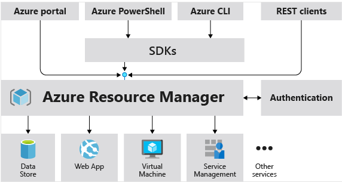
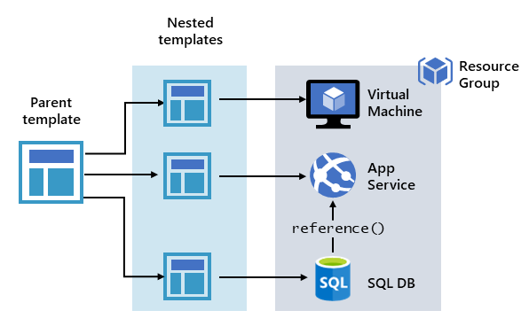
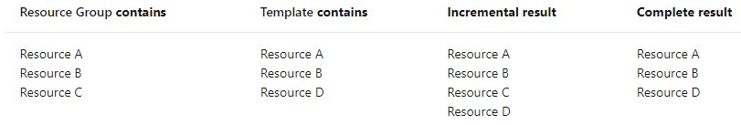

# Simple, but non-repeatable deployment
- Azure portal
- Azure CLI (az)
- Azure powershell (Powershell with Azure module)

# Using ARM (Azure Resource Manager) templates
## This is the recommended way
- Essentially, everything is an object in Azure
- We can create deployments in Azure, using ARM templates and parameter files
- The ARM templates can be deployed several ways:
    - Azure portal
    - Azure CLI (az)
    - Azure powershell (Powershell with Azure module)
    - REST API
    - Button in GitHub repository
    - Azure Cloud Shell
- The template file
  - **Parameters** - Provide values during deployment that allow the same template to be used with different environments
  - **Variables** - Define values that are reused in your templates. They can be constructed from parameter values
  - **User-defined functions** - Create customized functions that simplify your template
  - **Resources** - Specify the resources to deploy
  - **Outputs** - Return values from the deployed resources
- The Azure APIs are versioned by date, so I can deploy the same ARM template over and over again to the same API by specifying it in the template:
  - in the current template -> `"apiVersion": "2021-03-01"`
- Resources can be also updated via templates -> if the template specifies creating a resource but that resource already exists, Azure Resource Manager performs an update instead of creating a new asset
- Resources ca be deployed conditionally, using the "condition" function, in the "resources" template object

## Advantages of ARM templates
- **Declarative syntax** -> You can deploy not only virtual machines, but also the network infrastructure, storage systems, and any other resources you may need
- **Repeatable results** -> You can deploy the same template many times and get the same resource types in the same state
- **Orchestration** -> The Resource Manager orchestrates the deployment of interdependent resources, so they're created in the correct order

## A parent template can be defined, referencing other templates (essentially deploying an entire infrastructure in one go)
## These are called Nested templates


If you envision your tiers having separate lifecycles, you can deploy your three tiers to separate resource groups. 
The resources can still be linked to resources in other resource groups.

Azure Resource Manager analyzes dependencies to ensure resources are created in the correct order. 
If one resource relies on a value from another resource (such as a virtual machine needing a storage account for disks), 
you set a dependency. For more information, see Defining dependencies in Azure Resource Manager templates.

## Set the correct deployment mode
## The default mode is Incremental
### Complete mode -> a bit dangerous
- The Resource Manager deletes resources that exist in the resource group but aren't specified in the template
- If your template includes a resource that isn't deployed because condition evaluates to false, 
  the result depends on which REST API version you use to deploy the template. 
  If you use a version earlier than 2019-05-10, the resource isn't deleted. With 2019-05-10 or later, the resource is deleted. The latest versions of Azure PowerShell and Azure CLI delete the resource.

### Incremental mode -> safer
- The Resource Manager leaves unchanged resources that exist in the resource group but aren't specified in the template.
- Specify all properties for the resource, not just the ones you're updating
  If you don't specify certain properties, Resource Manager interprets the update as overwriting those values

### Set deployment mode
- Powershell
```
New-AzResourceGroupDeployment `
  -Mode Complete `
  -Name ExampleDeployment `
  -ResourceGroupName ExampleResourceGroup `
  -TemplateFile c:\MyTemplates\storage.json`
```
- Azure CLI
```
az deployment group create \
  --mode Complete \
  --name ExampleDeployment \
  --resource-group ExampleResourceGroup \
  --template-file storage.json
```

### Example results




# VM customization options

### Additional details 
- The VM image can be a custom one, not just the one provided by Azure
- VM limits: The current limit on a per-subscription basis is 20 VMs per region

### Availability options
- [Availability zones](https://docs.microsoft.com/en-us/azure/availability-zones/az-overview?context=/azure/virtual-machines/context/context)
- [Availability sets](https://docs.microsoft.com/en-us/azure/virtual-machines/availability-set-overview)
- [Virtual machine scale sets](https://docs.microsoft.com/en-us/azure/virtual-machine-scale-sets/overview?context=/azure/virtual-machines/context/context)

### VM sizes (types) -> You can resize the VM
- General Purpose -> Ideal for testing and development, small to medium databases, and low to medium traffic web servers
- Compute Optimized	-> Good for medium traffic web servers, network appliances, batch processes, and application servers
- Memory Optimized -> Great for relational database servers, medium to large caches, and in-memory analytics
- Storage Optimized -> High disk throughput and IO ideal for Big Data, SQL, NoSQL databases, data warehousing and large transactional databases
- GPU -> ML/Deep Learning -> Available with single or multiple GPUs
- High Performance Compute -> Monster